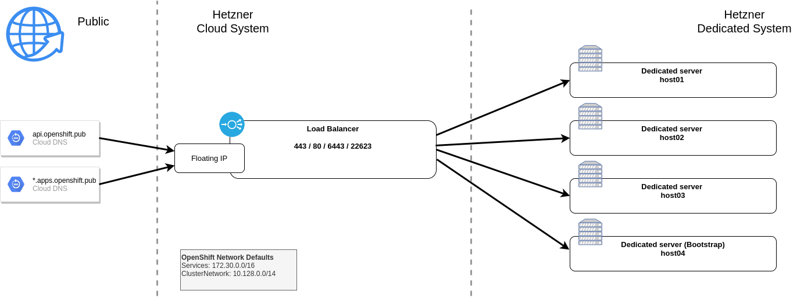
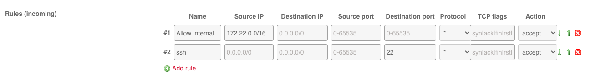
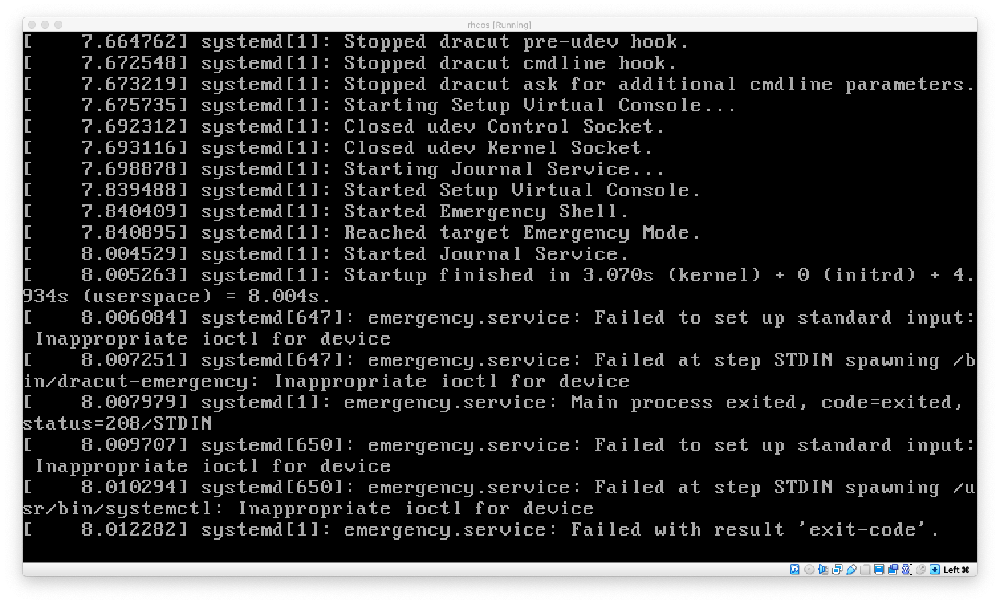

# OpenShift 4 on Hetzner BareMetal (dedicted server)

## Network Overview




## Issues to solve

### protect machine config server (22623)

Currently :22623 is public available, it should be only available for nodes.


Tcpdump on host01
```
19:56:48.618128 IP 49.12.23.25.26634 > 94.130.55.35.22623: Flags [S], seq 1010699155, win 64240, options [mss 1460,sackOK,TS val 1548548017 ecr 0,nop,wscale 7], length 0
19:56:48.618187 IP 94.130.55.35.22623 > 49.12.23.25.26634: Flags [S.], seq 1554818295, ack 1010699156, win 28960, options [mss 1460,sackOK,TS val 2776963539 ecr 1548548017,nop,wscale 7], length 0
19:56:48.618432 IP 49.12.23.25.26634 > 94.130.55.35.22623: Flags [.], ack 1, win 502, options [nop,nop,TS val 1548548018 ecr 2776963539], length 0
19:56:48.640778 IP 49.12.23.25.26634 > 94.130.55.35.22623: Flags [P.], seq 1:518, ack 1, win 502, options [nop,nop,TS val 1548548040 ecr 2776963539], length 517
19:56:48.640789 IP 94.130.55.35.22623 > 49.12.23.25.26634: Flags [.], ack 518, win 235, options [nop,nop,TS val 2776963561 ecr 1548548040], length 0
19:56:48.642483 IP 94.130.55.35.22623 > 49.12.23.25.26634: Flags [P.], seq 1:1578, ack 518, win 235, options [nop,nop,TS val 2776963563 ecr 1548548040], length 1577
19:
```
Source Adress is the address of the load balancer :-(


## High level steps

### Order baremetal server
### Prepare baremetal server

  * add dns entries - A and PTR
  * Install centos 8
    * document interface name
  * Test CoreOS installation (Note: coreos use EFI boot)
  * Switch to EFI boot via Ticket, example tickets:
      * Ticket#2021050503020988
      * Ticket#2021050603003594
      * Ticket#2021051903013942

### Setup Network
#### Attach dedicated server to vSwitch
#### Configure dedicated server firewall (allow internal traffic)



### Setup Load Balancer & DNS at hcloud
#### Start fedora 33 instance

After dnf update you have to fix dns -> fedora bug?
```
systemctl stop systemd-resolved.service ; systemctl disable systemd-resolved.service

rm -f /etc/resolv.conf
ln -s /run/systemd/resolve/resolv.conf /etc/resolv.conf

cat /etc/resolve.conf
nameserver 213.133.99.99
nameserver 213.133.100.100
nameserver 213.133.98.98

```
#### Connect network with vSwitch

#### Setup Proxy server

**Why proxy setup?**
Because of openshift installation use interfaces with a default gateway for main interface decision. We changed the default gw to 172.22.2.1 at vlan4000 interface to force to use the VLAN interface IP.

Additional we decided to complete disable public IP because bootstrap pick the first IP and this is the public one so bootstrap etcd member uses public API but all other nodes do not have access anymore to public IPs.

On the nodes the server nodeip-configuration.service takes care of the kubelet IP:
```
systemctl status nodeip-configuration.service
systemctl cat nodeip-configuration.service
```


```
dnf -y install tinyproxy
```

Add to `/etc/tinyproxy/tinyproxy.conf` :

```
Listen 172.22.1.10
Allow 172.22.0.0/16
```

Start
```
systemctl enable --now tinyproxy
systemctl status tinyproxy

```

#### Setup Load Balancer

```
dnf -y install podman
```

```
cat > /etc/systemd/system/openshift-4-loadbalancer.service <<EOF
[Unit]
Description=OpenShift 4 LoadBalancer CLUSTER
After=network.target

[Service]
Type=simple
TimeoutStartSec=5m

ExecStartPre=-/usr/bin/podman rm "openshift-4-loadbalancer"
ExecStartPre=/usr/bin/podman pull quay.io/redhat-emea-ssa-team/openshift-4-loadbalancer
ExecStart=/usr/bin/podman run --name openshift-4-loadbalancer --net host \
  -e API=bootstrap=172.22.2.6:6443,master-0=172.22.2.3:6443,master-1=172.22.2.4:6443,master-3=172.22.2.5:6443 \
  -e API_LISTEN=78.46.236.55:6443,172.22.1.10:6443 \
  -e INGRESS_HTTP=master-0=172.22.2.3:80,master-1=172.22.2.4:80,master-3=172.22.2.5:80 \
  -e INGRESS_HTTP_LISTEN=78.46.236.55:80,172.22.1.10:80 \
  -e INGRESS_HTTPS=master-0=172.22.2.3:443,master-1=172.22.2.4:443,master-3=172.22.2.5:443 \
  -e INGRESS_HTTPS_LISTEN=78.46.236.55:443,172.22.1.10:443 \
  -e MACHINE_CONFIG_SERVER=bootstrap=172.22.2.6:22623,master-0=172.22.2.3:22623,master-1=172.22.2.4:22623,master-3=172.22.2.5:22623 \
  -e MACHINE_CONFIG_SERVER_LISTEN=172.22.1.10:22623 \
  -e STATS_LISTEN=127.0.0.1:1984 \
  -e STATS_ADMIN_PASSWORD=aengeo4oodoidaiP \
  -e HAPROXY_CLIENT_TIMEOUT=1m \
  -e HAPROXY_SERVER_TIMEOUT=1m \
  quay.io/redhat-emea-ssa-team/openshift-4-loadbalancer

ExecReload=-/usr/bin/podman stop "openshift-4-loadbalancer"
ExecReload=-/usr/bin/podman rm "openshift-4-loadbalancer"
ExecStop=-/usr/bin/podman stop "openshift-4-loadbalancer"
Restart=always
RestartSec=30

[Install]
WantedBy=multi-user.target
EOF
```

```
systemctl daemon-reload
systemctl enable --now openshift-4-loadbalancer.service
```


#### Setup DNS

```
dnf -y install dnsmasq
```

```
cat > /etc/dnsmasq.conf << EOF
no-resolv
server=213.133.100.100
server=213.133.99.99
server=213.133.98.98
address=/apps.openshift.pub/172.22.1.10
user=dnsmasq
group=dnsmasq
listen-address=172.22.1.10
conf-dir=/etc/dnsmasq.d,.rpmnew,.rpmsave,.rpmorig
bind-dynamic
except-interface=lo
EOF
```

```
systemctl daemon-reload
systemctl enable --now openshift-4-loadbalancer.service
```

Add to `/etc/hosts`
```
172.22.1.10 api-int.openshift.pub api.openshift.pub
172.22.2.3 master-0.compute.local
172.22.2.4 master-1.compute.local
172.22.2.5 master-3.compute.local
172.22.2.6 bootstrap.compute.local
```


### Install coreos on hetzner baremetal

**Important: RHCOS supports only ignition.version 3.1.0**


Boot into rescue system:
```
curl -L -O https://mirror.openshift.com/pub/openshift-v4/clients/coreos-installer/v0.6.0-3/coreos-installer
chmod +x coreos-installer

curl -L -O https://mirror.openshift.com/pub/openshift-v4/dependencies/rhcos/4.6/4.6.1/rhcos-4.6.1-x86_64-metal.x86_64.raw.gz

./coreos-installer install /dev/nvme0n1 \
  --ignition-file config.ignition \
  --copy-network --firstboot-args="rd.neednet=1" \
  --network-dir ./network-config/ \
  --insecure \
  --image-file rhcos-4.6.1-x86_64-metal.x86_64.raw.gz
```
