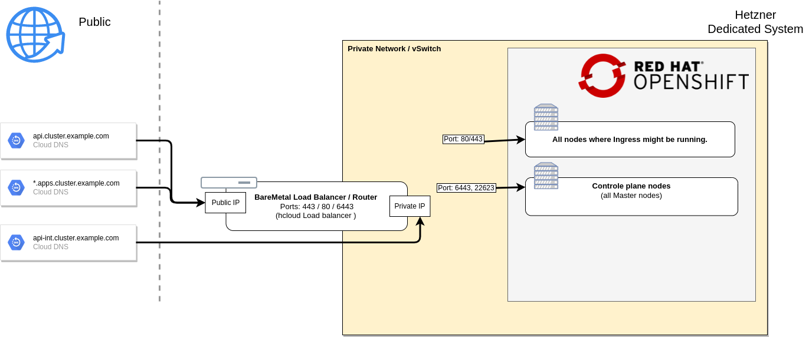

# OpenShift 4 on Hetzner BareMetal (dedicted server)

## Network Overview




## Cluster design

Deppends on the cluster.

But for all: One of the worker is used to be the bootstrap during installation.

## Installation

You can run all playbooks inside a toolbox [](https://quay.io/repository/operate-first/hetzner-baremetal-toolbox) :

```bash
toolbox create --image quay.io/operate-first/hetzner-baremetal-toolbox hetzner-toolbox
toolbox enter hetzner-toolbox
```

Source of the toolbox [Containerfile](/Containerfile)


### Create initial hosts.yaml based on hosts.yaml.example

```bash
cp -v hosts.yaml.example hosts.yaml
$EDITOR hosts.yaml
```

### DNS & load balancer/router preperations

  * Order a BareMetal Server as Load Balancer & Router.
      * [Prepare RHEL 8 Image](https://keithtenzer.com/cloud/how%20-to-create-a-rhel-8-image-for-hetzner-root-servers/)
      * Install Server with RHEL 8

  * Configure Network (public & private)
      * Coonfigure server as router between priavet and public (act as default gateway for alle nodes.)

  * Configure load balancer:
      * Public for api & ingress
      * Private for api-int

  * Configure DNS entries for
      * `api.<cluster_name>.emea.operate-first.cloud`
      * `api-int.<cluster_name>.emea.operate-first.cloud`
      * `*.apps.<cluster_name>.emea.operate-first.cloud`


### Hardware preperations

  * Order a BareMetal Server - Issue for sizing: #6

  * Configure DNS ( A & PTR ) for BareMetal Server
      `<hostname>.emea.operate-first.cloud`

  * Create private vSwitch and add ID to `hosts.yaml`

  * Attach server to private vSwitch

  * [Install Centos 8 to determine the network interface name](docs/install-centos-8.md)

  * Check network interface names on centos 8: `ansible -m shell -a "ip link | grep enp | cut -f2 -d':'" all`

  * Add server to `hosts.yaml`

  * Wipe all servers after Centos 8 installaion: `./wipe.yaml`
    Please run `./wipe.yaml` again if some failed agure.

  * Run a RH CoreOS Test installation with ssh-only ignition
    ```bash
    ./reset-server.yaml [-l hostname]
    # SSh into rescue system and run coreos-install
    #  command printed out at the end ot the playbook.
    ```

    Check installation, server boot? Can connect via SSH?

  * Boot Rescue mode

    ```bash
    ./force-rescue-mode.yaml [-l hostname]
    ```

    Check if resecue system is booted:

      **If NOT**: File a ticket to switch into EFI boot (Example Tickets: Ticket#2021050503020988, Ticket#2021050603003594, Ticket#2021051903013942)

  * Check if you can switch between RH CoreOS and rescue mode.

  * Configure firewall
    ```bash
    ./configure-hrobot-firewall.yaml [-l hostname]
    ```

### OpenShift installation

Prerequisites:
  * At least 4 prepared nodes (see Hardware preperations)
  * DNS & load balancer preperations


#### Reset server

Boots into rescue mode and prepare rescue system to install Red Hat CoreOS

```bash
./reset-server.yaml
```

#### Wipe  server

To ensure nothing is on the disk wipe it:

```bash
./wipe-server.yaml
```


#### Create ignition config and transfer to hosts

```bash
./create-ignition.yaml
```

#### Run the installer


```bash
./run-installer.yaml
```

Optional split it into two steps:

```bash
./run-installer.yaml --skip-tags reboot
# Check output
./run-installer.yaml --tags reboot
```

#### During installation watch for CSR

Accept pending CSR from your worker nodes

```bash
oc get csr | awk '/Pending/ { print $1}' | xargs -n1 oc adm certificate approve
```

### Add bootstrap node as worker

#### Adjust haproxy config

```bash
ssh -l root -i <private-key> <private lb vm>
vi /etc/haproxy/haproxy.cfg
systemctl reload haproxy
```

<details>
  <summary>Check a proxy stats</summary>

```bash
echo "show stat" | nc -U /var/lib/haproxy/stats | cut -d "," -f 1,2,18,57| column -s, -t;
# pxname               svname                           status  last_chk
machine-config-server  FRONTEND                         OPEN
machine-config-server  host01.example.com  UP
machine-config-server  host02.example.com  UP
machine-config-server  host04.example.com  UP
machine-config-server  BACKEND                          UP
api                    FRONTEND                         OPEN
api                    host01.example.com  UP
api                    host02.example.com  UP
api                    host04.example.com  UP
api                    BACKEND                          UP
```

</details>

#### Adjust `host.yaml`

Move bootstrap node from bootstrap to worker hostgroup.

#### Boot rescure mode

```bash
 ./force-rescue-mode.yaml -l <bootstrap-node>
```

#### Prepare installation
```bash
./reset-server.yaml -l <bootstrap-node>
```

#### Preare ignition config
```bash
./create-ignition.yaml -l <bootstrap-node>
```

#### Wipe server

```bash
./wipe-server.yaml -l <bootstrap-node>
```

#### Run the installer


```bash
./run-installer.yaml -l <bootstrap-node>
```

Optional split it into two steps:

```bash
./run-installer.yaml --skip-tags reboot -l <bootstrap-node>
# Check output
./run-installer.yaml --tags reboot -l <bootstrap-node>
```

#### Watch for pending CSRs

Accept pending CSR from your worker node.

```bash
oc get csr | awk '/Pending/ { print $1}' | xargs -n1 oc adm certificate approve
```

### Post installation

#### Remove worker label from master

```
oc edit scheduler
```
Change `mastersSchedulable: true` to `mastersSchedulable: false`


### OpenShift reinstallation

Its recommended to wipe the disk with `wipe-server.yaml` playbook bevor reinstallation.

