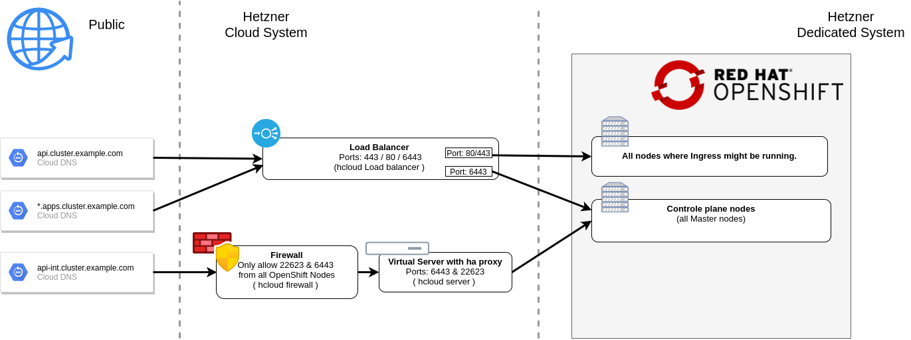

# OpenShift 4 on Hetzner BareMetal (dedicted server)

## Network Overview

## High-level steps

### Hardware preperations
  * Order a BareMetal Server - Issue for sizing: #...
  * Configure DNS ( A & PTR ) for BareMetal Server
      `<hostname>.emea.operate-first.cloud`
  * Install Centos 8 to determine the network interface name
  * Run a RH CoreOS Test installation with ssh-only ignition
      * Check installation, server boot? Can connect via SSH?
  * Boot Rescue mode - should fail! :-)
  * File a ticket to switch into EFI boot (Example Tickets: Ticket#2021050503020988, Ticket#2021050603003594, Ticket#2021051903013942)
  * Check if you can switch between RH CoreOS and rescue mode.

### DNS & load balancer preperations

  * Configure load balancer:
      * Public for api & ingress
      * Private for api-int

  * Configure DNS entries for
      * `api.<cluster_name>.emea.operate-first.cloud`
      * `api-int.<cluster_name>.emea.operate-first.cloud`
      * `*.apps.<cluster_name>.emea.operate-first.cloud`

### OpenShift installation

Prerequisites:
  * At least 4 prepared nodes (see Hardware preperations)
  * DNS & load balancer preperations

